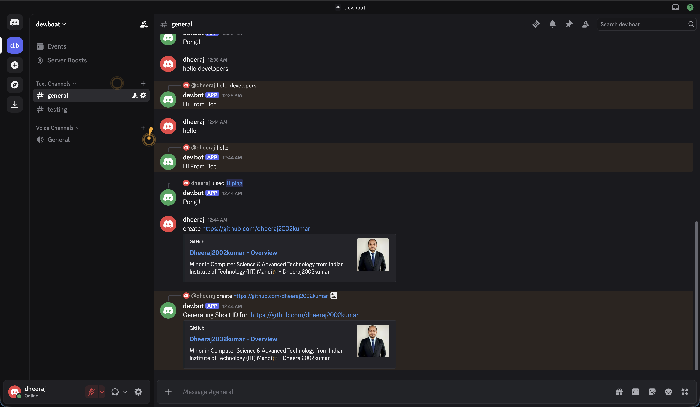

# Discord Bot

A simple Discord bot built with Node.js and discord.js. This project currently includes a basic message responder and a slash command setup for a ping command and a create command placeholder.

## Demo



## Features

- Basic bot startup with Discord.js v14
- Message listener that replies to messages
- Slash command registration via `command.js`
- Quick local development using nodemon

## Requirements

Before running the bot, make sure you have:

- Node.js installed
- A Discord bot token
- A Discord server where the bot is invited

## Installation

1. Clone the repository
2. Open the project folder
3. Install dependencies:

```bash
npm install
```

## Running the Bot

Start the bot locally:

```bash
npm start
```

This uses the `start` script in `package.json`, which runs:

```bash
nodemon index.js
```

## Registering Slash Commands

To register the commands defined in `command.js`, run:

```bash
node command.js
```

This will refresh the application commands for your bot.

## Project Structure

```text
discord_bot/
├── command.js
├── index.js
├── package.json
├── README.md
└── node_modules/
```

## Bot Behavior

- If a user sends a message starting with `create`, the bot responds with a short message indicating generation is in progress.
- Any other message triggers a response: `Hi From Bot`.
- The interaction handler replies with `Pong!!` when a slash command is used.

## Important Note

For production use, avoid storing your Discord bot token directly in source files. Instead, use environment variables such as `DISCORD_TOKEN` and load them securely.

## License

This project is licensed under the ISC License.
